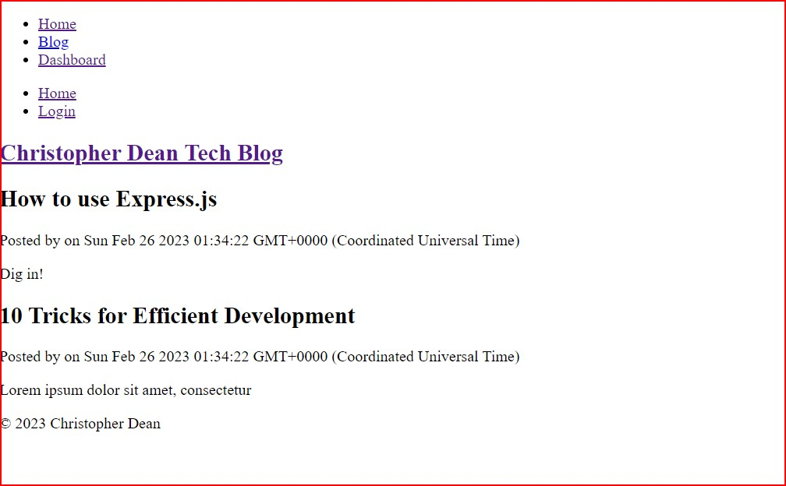
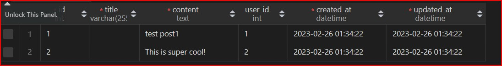
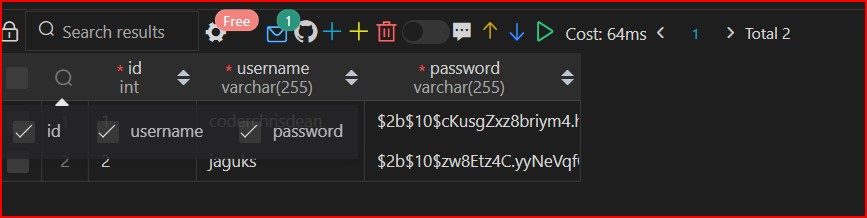
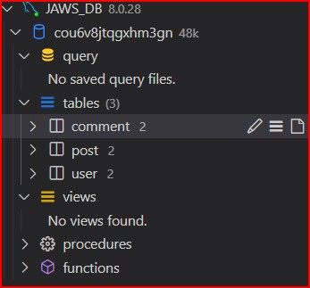
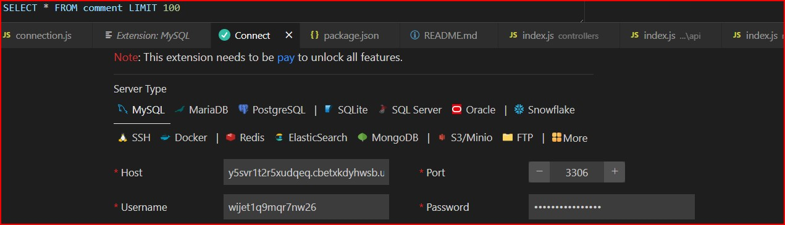

# Tech Blog
Tech Blog Module 14 Homework Assignment

## Table Of Contents
* Description
* Installation
* Usage
* Credits
* License
* Screenshots
* Questions

## Description
This is the homework assignment for Module 14 for the University of California, Berkeley Coding Bootcamp.  This assignment is to create a tech blog using the Model-View-Controller paradigm.  The user can create an account, log in, and create, edit, and delete blog posts.  The user can also comment on other users' posts.  I wanted to build a blog since from when I enrolled in the class and kind of got ahead of myself because of all the features and things I wanted to add.  But will need to revert to MVP.

## Installation
This application is deployed to Heroku no Installation is needed.

## Usage
Visit the deployed application at https://glittering-galaxy.herokuapp.com/

## GitHub Repository

https://github.com/coderchrisdean/glittering-galaxy

## Credits

## License

## Screenshots

Here is a screenshot of the rendered homepage with the seeded blog posts, as well as connection to the database using SqlDatabase extension.  This is just proof that I finally got my code to work even though it isn't styled.

## Questions
If you have any questions about the repo, open an issue or contact me directly at coderchrisdean@gmail.com. 

*** I AM SUBMITTING THIS INCOMPLETE AS I NEED TO FINISH OTHER ASSIGNMENTS. HOWEVER I GOT MY PAGE TO RENDER AND MOST ROUTES WORKING ***

